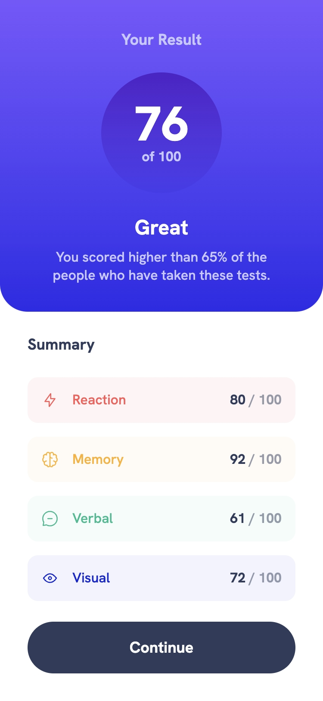
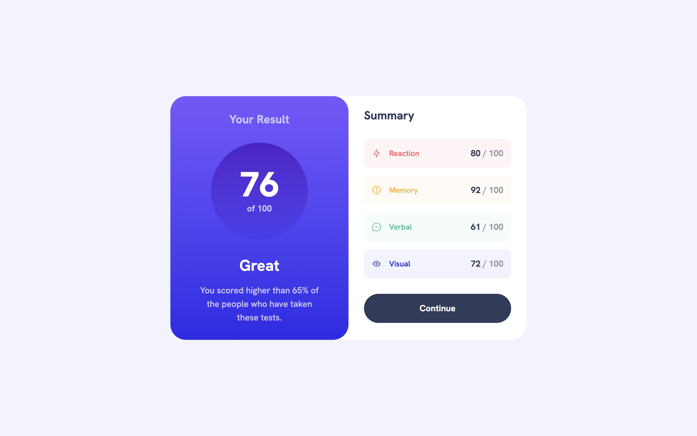

# Frontend Mentor – Results Summary Component

A responsive results summary card built with React, TypeScript, and Tailwind CSS - focused on typed data modeling, a type-safe category-to-style mapping, semantic HTML, and a mobile-first responsive layout.

## 🔗 Links

Live site: [View live](https://results-summary-component-dionysialemonaki.vercel.app/)

## ✅ Acceptance Criteria

Users should be able to:

- View the optimal layout depending on their device's screen size
- See hover and focus states for all interactive elements on the page

## 📸 Screenshots

Mobile:



Desktop:



## 🏗️ Built With

- React 19
- TypeScript
- Tailwind CSS v4
- Vite
- Semantic HTML

## 🎨 What I Focused On

### Designing The Type System

Before touching JSX, I modeled the actual shape of the data. `Category` is a literal union of the four fixed category names, and `category` in `Result` is typed against that union.

```typescript
export type Category = "Reaction" | "Memory" | "Verbal" | "Visual";

export interface Result {
  id: number;
  icon: string;
  category: Category;
  score: number;
}
```

### Typing the Data

`data.ts` is explicitly typed as `Result[]`, so every object in the array is validated at write time.

```typescript
import type { Result } from "./types";
import iconReaction from "./assets/images/icon-reaction.svg";
import iconMemory from "./assets/images/icon-memory.svg";
import iconVerbal from "./assets/images/icon-verbal.svg";
import iconVisual from "./assets/images/icon-visual.svg";

export const results: Result[] = [
  { id: 1, icon: iconReaction, category: "Reaction", score: 80 },
  { id: 2, icon: iconMemory, category: "Memory", score: 92 },
  { id: 3, icon: iconVerbal, category: "Verbal", score: 61 },
  { id: 4, icon: iconVisual, category: "Visual", score: 72 },
];
```

The overall score is derived once in `App` from the four category scores via `reduce`.

```typescript
const sumOfScores = results.reduce(
  (accumulator, currentValue) => accumulator + currentValue.score,
  0,
);
const finalScore = Math.floor(sumOfScores / results.length);
```

### Making Category-to-Style Mapping Type-Safe

Each category needs its own background and text color. `Category` is used as the key of a `Record`, so TypeScript enforces that every category has a style defined.

```typescriptreact
import type { Result, Category } from "../types";

type ResultItemProps = Omit<Result, "id">;

interface Styles {
  bg: string;
  text: string;
}

const resultItemStyles: Record<Category, Styles> = {
  Reaction: { bg: "bg-red-50", text: "text-red-400" },
  Memory: { bg: "bg-yellow-50", text: "text-yellow-400" },
  Verbal: { bg: "bg-green-50", text: "text-green-500" },
  Visual: { bg: "bg-blue-50", text: "text-blue-800" },
};

const ResultItem = ({ icon, category, score }: ResultItemProps) => {
  return (
    <li
      className={`p-4 flex justify-between items-center rounded-xl ${resultItemStyles[category].bg}`}
    >
      <div className="flex items-center gap-4">
        
        <p className={`font-medium ${resultItemStyles[category].text}`}>
          {category}
        </p>
      </div>
      <p className="font-bold md:text-lg text-navy-950">
        <span>{score}</span>
        <span className="opacity-50"> / 100</span>
      </p>
    </li>
  );
};
```

`ResultItemProps` is derived from the same `Result` type with `Omit<Result, "id">`.

### Creating Accessible Interactive States

`Button` is a plain `<button type="button">`. Focus is handled with `focus-visible`, not `:focus`.

```typescriptreact
const Button = ({ children }: ButtonProps) => {
  return (
    <button
      type="button"
      className="bg-navy-950 p-4 rounded-full text-white text-lg font-bold cursor-pointer hover:bg-linear-to-br hover:from-violet-400 hover:to-blue-500 focus-visible:outline-4 focus-visible:outline-offset-4 focus-visible:outline-dotted focus-visible:outline-blue-800"
    >
      {children}
    </button>
  );
};
```

## Credits

[Design from Frontend Mentor](https://www.frontendmentor.io/challenges/results-summary-component-CE_K6s0maV) and
[Icon by Icons8](https://icons8.com/icon/kuU7I7uPlHfo/trophy)
